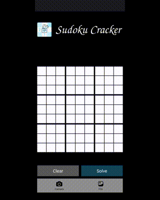

# Sudoku Cracker

> An open-source, offline Sudoku solver for Android written in Python.

---

Sudoku Cracker is a Kivy app that combines OCR with a classic recursive backtracking algorithm.



#### How it works

- **Computer vision** (OpenCV): the frame is converted to grayscale, blurred, and thresholded; the largest quadrilateral contour is found and perspective-warped into a square grid. The camera preview overlays the detected outline in real time.
- **Optical character recognition** (RapidOCR / PP-OCRv5 via ONNX Runtime): the warped grid is split into 81 cells. Populated cells are detected by per-cell pixel standard deviation, then digits are recognised offline on a background thread.
- **Solving** (recursive backtracking): fills empty cells by trying values 1–9 and backtracking when a placement violates row, column, or 3×3-block constraints.

Recognised or manually entered digits appear on the home screen; you can edit them before solving.

## Attributions

---

<a href="https://www.flaticon.com/free-icons/unlocked" title="unlocked icons">Unlocked icons created by Freepik - Flaticon</a>

<a href="https://www.flaticon.com/free-icons/sudoku" title="sudoku icons">Sudoku icons created by Freepik - Flaticon</a>

<a href="https://www.flaticon.com/free-icons/camera" title="camera icons">Camera icons created by Freepik - Flaticon</a>

<a href="https://www.flaticon.com/free-icons/image-placeholder" title="image placeholder icons">Image placeholder icons created by Graphics Plazza - Flaticon</a>

## Development Setup

---

Install dependencies:

```bash
uv venv --python 3.12.3
source .venv/bin/activate
uv sync --extra dev
```

Bootstrap the OCR models:

```bash
python scripts/bootstrap_ocr_models.py
```

Install and run pre-commit hooks:

```bash
pre-commit install
pre-commit run --all-files
```

## Build from source

---

Buildozer packages this Kivy app into an APK using [python-for-android](https://python-for-android.readthedocs.io/). Configuration lives in [`buildozer.spec`](buildozer.spec).

**Further reading:**

- [Buildozer installation](https://buildozer.readthedocs.io/en/latest/installation.html)
- [Buildozer quickstart](https://buildozer.readthedocs.io/en/latest/quickstart.html)
- [Buildozer specifications](https://buildozer.readthedocs.io/en/latest/specifications.html)
- [Kivy Android packaging guide](https://kivy.org/doc/stable/guide/packaging-android.html)

Buildozer runs on **Linux or macOS only** (on Windows, use WSL2 with a Linux distro).

#### 1. Install system dependencies

On Ubuntu 24.04:

```bash
sudo apt update
sudo apt install -y git zip unzip openjdk-17-jdk python3-pip autoconf libtool \
  pkg-config zlib1g-dev libncurses5-dev libncursesw5-dev libtinfo5 cmake \
  libffi-dev libssl-dev
```

Ensure `adb` is available (for deploy). It ships with Android platform-tools, or install via:

```bash
sudo apt install -y adb
```

#### 2. Prepare your Android device

1. Enable **Developer options** and **USB debugging** on the device.
2. Connect the device via USB.
3. Confirm it is detected:

```bash
adb devices
```

You should see your device listed as `device` (not `unauthorized`). If unauthorized, accept the debugging prompt on the phone and run `adb devices` again.

#### 3. Bootstrap OCR models (if you haven't already)

OCR ONNX weights are not committed to the repo (see `.gitignore`). Before building the APK, pull them into `assets/models/ocr/`:

```bash
python scripts/bootstrap_ocr_models.py
```

This warms up RapidOCR, copies `ch_PP-OCRv5_det_server.onnx` and `en_PP-OCRv5_rec_mobile.onnx` from the installed `rapidocr` package, and refreshes `assets/models/ocr_models.json`. Requires a prior `uv sync` so `rapidocr` is available. Without this step, the APK will lack bundled models and OCR will fail at runtime.

#### 4. Build the debug APK

From the project root:

```bash
buildozer -v android debug
```

The first build downloads the Android SDK/NDK and compiles native dependencies (including OpenCV, ONNX Runtime, and numpy). Expect **30–60+ minutes** on the first run; later builds are much faster. Cached SDK/NDK files are stored under `~/.buildozer/`.

On success, the APK is written to `bin/`.

#### 5. Deploy and run on a connected device

With the device connected:

```bash
buildozer android deploy run
```

Or build, install, and launch in one step:

```bash
buildozer android debug deploy run
```

To stream logs:

```bash
buildozer android debug deploy run logcat
```

#### Common errors and quick fixes

| Error | Fix |
|-------|-----|
| `in order to build Numpy you must set minimum NDK api (minapi) to 24` | Already set in `buildozer.spec` (`android.minapi = 24`, `android.ndk_api = 24`). Do not lower these values. |
| `adb devices` shows `unauthorized` | Unlock the phone and accept the USB debugging authorization dialog. |
| `adb devices` shows no devices | Try another USB cable/port; confirm USB debugging is enabled. |
| Buildozer stuck on SDK license prompt | `android.accept_sdk_license = True` is set in `buildozer.spec`. If prompted manually, type `y` and press Enter. |

#### Scope - What's packaged

`buildozer.spec` bundles application source and assets:

- `main.py`
- `modules/` (Python files)
- `assets/` — UI images plus `assets/models/ocr_config.yaml`, `assets/models/ocr_models.json`, and bootstrapped `assets/models/ocr/*.onnx`
- `p4a_hook.py` (python-for-android build hook)

Excluded: `tests/`, `p4a_local_recipes/`.

Runtime requirements include `python3`, `kivy`, `numpy`, `opencv`, `pillow`, `rapidocr`, `onnxruntime`, `pyyaml`, `pyclipper`, `shapely`, and Android bindings (`android`, `pyjnius`, `plyer`). See the full `requirements` line in `buildozer.spec`.

## Commits and branch naming

---

**Commits** follow [Conventional Commits](https://www.conventionalcommits.org/): `type(scope): subject` — e.g. `feat(ocr): add RapidOCR backend`, `fix(android): camera rotation`, `docs: update README`. Common types: `feat`, `fix`, `docs`, `chore`, `test`.

**Branches:** `feat/…`, `fix/…`, or `chore/…` off `dev` for day-to-day work; `release/vX.Y.Z` when preparing a release.

## Semantic versioning

---

Versions use [Semantic Versioning](https://semver.org/): `MAJOR.MINOR.PATCH`, with optional pre-release labels (`-alpha`, `-beta`, `-rc`). Bump **MAJOR** for breaking changes, **MINOR** for new features, **PATCH** for fixes. Pre-releases (e.g. `1.0.0-beta.1`) precede a stable `1.0.0`. The canonical version lives in `pyproject.toml` and `buildozer.spec`; tag a release commit as `vX.Y.Z`.

## Branching strategy

---

This project follows a GitFlow-style workflow:

- **`master`** — always reflects the latest stable release. Do not develop directly on this branch.
- **`dev`** — integration branch where all day-to-day development lands.
- **Feature branches** — branch from `dev`, merge back into `dev` when ready.
- **Release branches** (e.g. `release/v1.0.0`) — used to prepare a release (version bumps, final fixes, build and release APKs). When ready, merge into both `dev` and `master`.
- **Tags** — a `v*` tag on a commit triggers the [Release APK](.github/workflows/release-apk.yml) workflow, which builds a signed release APK and creates a GitHub Release. If a build fails, fix on the release branch and move the tag (`git tag -f vX.Y.Z && git push -f origin vX.Y.Z`), or re-run / use **workflow_dispatch**.

The release workflow expects these repository secrets:

| Secret | Purpose |
| --- | --- |
| `ANDROID_KEYSTORE_BASE64` | Base64-encoded release keystore |
| `P4A_RELEASE_KEYSTORE_PASSWD` | Keystore password |
| `P4A_RELEASE_KEYALIAS` | Key alias |
| `P4A_RELEASE_KEYALIAS_PASSWD` | Key password |

**CI** runs on pushes to `dev` and on pull requests targeting `master`. Pushing directly to `master` bypasses those checks, so prefer merging via pull request whenever possible.

Typical release flow:

1. Prepare the release on `release/vX.Y.Z` (version bumps, final fixes).
2. Tag that commit and push the tag: `git tag v1.0.0 && git push origin v1.0.0`.
3. Wait for the Release APK workflow to succeed and verify the GitHub Release. If it fails, fix on the release branch and re-tag as needed.
4. Merge `release/vX.Y.Z` back into `master` and `dev` so `master` reflects the latest release and `dev` is ready for further work.

